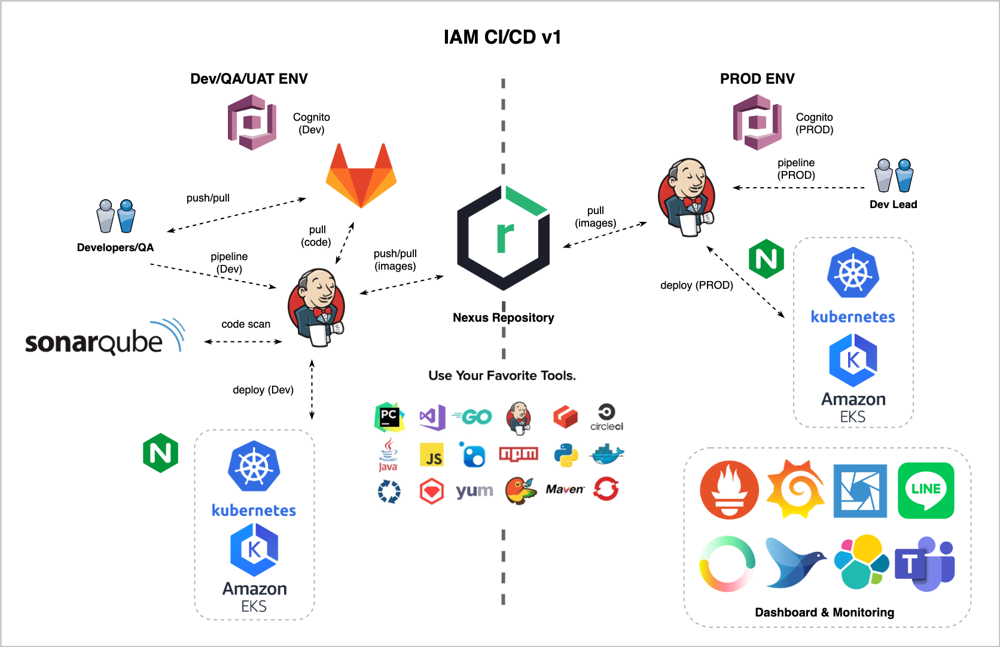

# demo-app-k8s

### Workshop Kubernetes (k8s) Demo App
GitHub/GitLab + Jenkins + k8s (EKS)

### IAM CI/CD v1 Overview


- Jenkins: https://cicd.7-11.tech/
- Nexus: https://repository.7-11.io:8081/
- SonarQube: https://sq.7-11.io/
- Monitoring: https://monitor-dev.7-11.tech/

### Update kubeconfig EKS Dev
1.Install aws cli

2.Install kubectl

3.Insert aws credentials to ~/.aws/credentials
```
[sds-eks-dev-workshop]
aws_access_key_id=xxx
aws_secret_access_key=xxx
```

4.Update kubeconfig (~/.kube/config) with aws cli
```
aws eks update-kubeconfig --name sds-eks-dev \
--region ap-southeast-1 \
--profile sds-eks-dev-workshop
```

5.Install Lens (Options)
https://k8slens.dev/

6.Test 
```
kubectl get node
```
- Open Lens add sds-eks-dev cluster

## Ref:
- DO280
https://www.redhat.com/en/services/training/do280-red-hat-openshift-administration-II-operating-production-kubernetes-cluster
- DO288
https://www.redhat.com/en/services/training/do288-red-hat-openshift-development-ii-containerizing-applications
